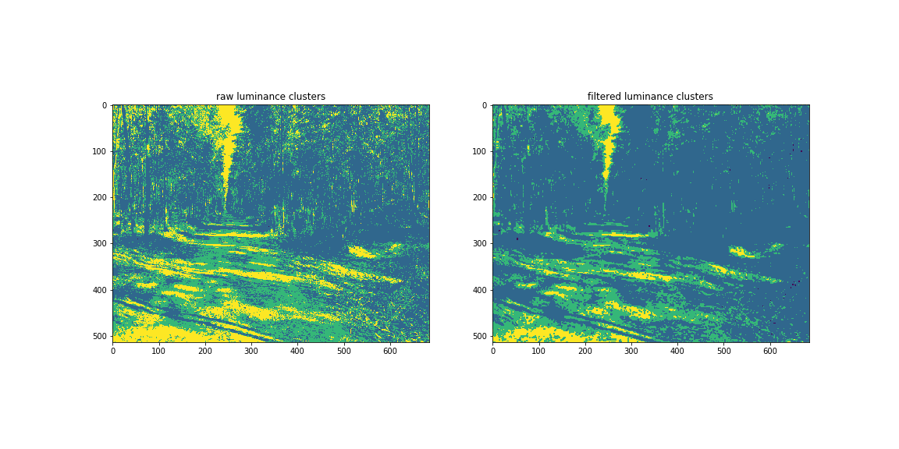
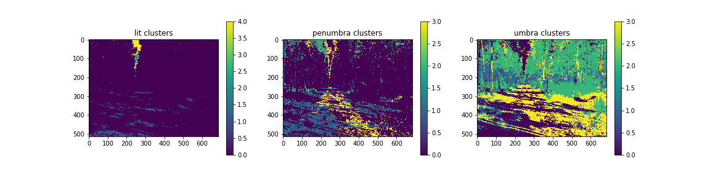
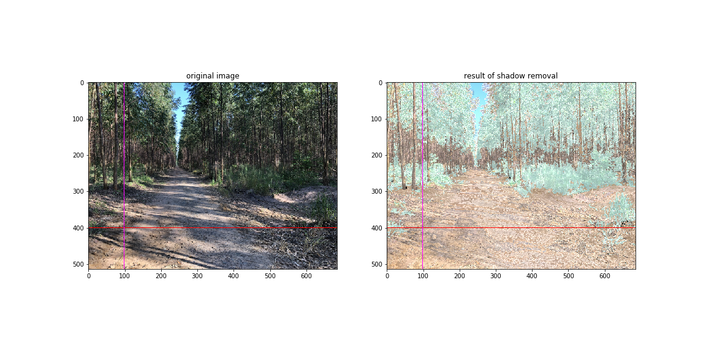
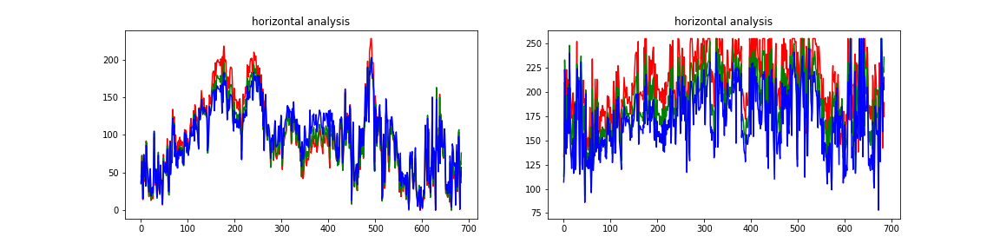
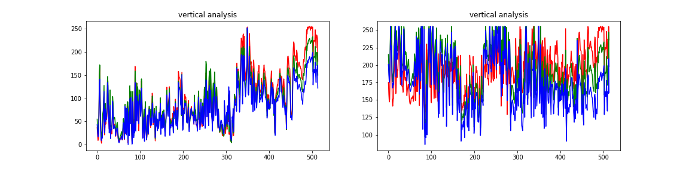

# **Shadow removal for image segmentation in forest ground image**

**Luiz Alberto Hiroshi Horita**

**Nº USP: 6882704**

## **Abstract**

Image processing is an interesting and very challenging subject that can be used in many different applications such as security cameras, robotization of industries, autonomous vehicles in many different environments indoor and outdoor. Independently of the application, in real life one of the main causes of environment noise is shadow, which can heavily distort both image intensity (luminance) and color (chrominance). With this in mind, this project's goal is to treat this problem specificaly in forests ground images aiming offroad mobile robotization. For that, the focus is to detect the shadows and remove them, so the objects can clearly be seen and segmented.

## **1. Main objective**

Given the eucalyptus plantation scenario, this work's goal is to treat the shadow noise problem that occur in some specific period of a sunny day, for example at noon when the sun light is strong enough to project shadow spots all over the road, which difficult the image segmentation for object detection.

For this work, it is important to notice that as its goal is to detect and remove the shadow spots not worrying with performance for video frame processing, so every processing here will be done in a single image at a time.

The input images of this program must be from eucalyptus plantation's streets (see example on Figure1 below). All images used in this project was acquired by the author.

**Figure 1** - Example of shadow noise on an eucalyptus plantation's street.

## **2. The shadow**

"Shadows will occur when direct light from a light source is partially or totally occluded. Shadow can be divided into two types: self shadow and cast shadow.
The self shadow is the part of an object that is not illuminated by direct light; the cast shadow is the dark area projected by an object on the background" [1].

**Figure 2** - Explanation of shadow (picture from [2]).

The cast shadow of an object is partioned into umbra and penunbra regions. The umbra region is the part of the shadowed surface in which the direct light source is completely obscured by the occluding object. The penumbra is the part of the surface where the light source is only partially occluded, and it occurs when the light source is not a point source or due to diffraction of light rays [2].

## **3. Methodes**

### **3.1. Detecting the shadows**

Shadow detection algorithm must find the image regions in which there are shadows (umbra and penumbra), based on luminance of each pixel.

#### **3.1.1. Color spaces analysis**

First of all, an analysis of the possible color spaces and their combination into a grayscale was done to choose the best option for shadowed regions detection on scenario.

On first try, the V (value) layer of HSV color space was used to find the shadowed regions on image (see the [1stTry notebook](./notebook/1stTry.ipynb)).

Then, after the last assignment, it was presented the luminance as a combination of RGB colors as shown, whach was used as attribute to find shadowed regions.

    luminance = 0.299 * R + 0.587 * G + 0.114 * B

#### **3.1.2. Clustering image into lit, penumbra and umbra regions**

Determined the luminance as the attribute to be used to separate the lit and shadowed (penumbra and umbra) regions, the clustering was applied. The result of this step can be seen on Figure 3.

Figure 3 - luminance clustering to find lit, penumbra and umbra regions.

The cropped regions of the image can be seen at Figure 4.

Figure 4 - cropped scene into lit, penumbra and umbra regions

#### **3.1.3. Filtering clusters from noise**

After the luminance clustering step, the adaptive filter was applied so the noise (unecessary spread "dots") was removed.

Figure 5 - luminance clusters filtered.

P.S.: observe that because this is a scenario with many small details, many information actually is lost through these steps.

### **3.2. Clustering the luminance clusters based on color**

Since the goal of this algorithm is to remove shadow by redistributing the pixel values from shadowed regions based on lit regions' histogram, it is necessary to find each subregions from luminance clustering so the equalization is done properly.

In other words, the shadowed regions of road must be equalized based on lit region of road, and so for forest leafs and woods regions.

Then, in this step clustering based on color seems to be the most appropriate approach.
The result of this step can be seen at the Figure 6.

Figure 6 - lit, penumbra and umbra's subclusters based on colors.

Analysing the previews step's result, visually can be seen that:
- On penumbra regions: clusters 1 and 3 can be considered as road, cluster 2 as green leafs from forest.
- On umbra regions: cluster 1 as woods from forest, cluster 2 as green leafs from forest, cluster 3 as road.
- On lit regions: cluster 1 as road, clusters 2 and 3 as green leafs from forest, cluster 4 as sky.

P.S.: observe the clusters labeled 1 have centroid on red color (R, G, B = 255, 0, 0), the clusters labeled 2 have centroid on green (R, G, B = 0, 255, 0), and cluster labeled 3 have centroid on blue (R, G, B = 0, 0, 255) .

### **3.3. Removing the shadows**

In the end, now we have all luminance clusters an the respective subclusters, the histogram equalization can be done for each of them.

#### **3.3.2. Enhancing histograms from shadow regions**

Basically, what was done in this step is the enhancement of the histogram on each regions clustered (road shadows, green forests leafs shadows and forest's woods shadows) based on each respective lit regions. The obtained result can be seen on Figure 7.

Figure 7 - Result of shadow removal.

## **4. Results and discussion**

To reach this result, it were tried other approaches (see [1stTry notebook](./notebook/1stTry.ipynb), [2ndTry notebook](./notebook/2ndTry.ipynb) and [3rdTry notebook](./notebook/3rdTry.ipynb)) which had some wrong color results.

This approach showed much better results in comparison with all others in terms of approximating the color distribution on shadow (penumbra and umbra) regions from the lit regions.

To be able of analysing the level of values on each channel before and after running the program, it was plotted the graph containing a vertical and horizontal section of the images.

So, plotting the values of one of the last rows of the image, in which there are almost half of pixels on lit regions and the other half on shadowed regions, it is possible to compare the result from original values (see on Figure 10). On original image, the shadowed pixels have lower values and indeed the blue channel has higher values upon other two color channels; on the other hand, after running the program, the levels of values on shadowed regions are more likely the lit regions.

Same can be observed with vertical section plotting (see on Figure 10).

Figure 8 - Original and resultant images with marked line under which the values analysis were done (see Figures 9 and 10).

Figure 9 - horizontal section analysis.

Figure 10 - vertical section analysis.

### **4.1. The failures**

Before the result obtained in this report, some other approaches were tried to remove the shadow from scene.

**i. First approach: histogram equalization.**
   
Consisted of finding shadowed regions by limiarizing the image based on V chanel of HSV converted colorspace and equalizing the shadow regions linearly filling all uint-8 values.

Figure 11 - 1st approach failed result.

**ii. Second approach: luminance limiarization and color clustering.**
   
In this approach the main steps were limiarizing the image based on V channel of HSV colorspace, clustering each lit an shaddow regions into 3 clusters based on color and position, then equalizing each shadow regions based on correspondent lit regions.

Figure 12 - 2nd approach failed result.

**iii. Third approach: luminance clustering and color clutering.**

In this approach the main steps were clustering the image into lit, penumbra and umbra regions based on luminance values (a linear combination amongo R, G, B values), clustering each lit an shaddow regions into 3 clusters based on color and position, then equalizing each shadow regions based on correspondent lit regions.

Figure 13 - 3rd approach failed result.

## **5. Conclusion**

The idea of removing shadows from a scenario of eucalyptus forest is very complex since there are many small and thin details (dry leafs on the ground, the woods) that are not necessarily noise, depending of what is the purpose of the image caption.

So, in the end, with this approach it was not possible to properly remove the shadow and keeping quality of image, instead a lot of information was lost in the end, as can be seen.

But, if consider this a method to remove the noise caused by the shadow regions when the goal is to segment road from other things (obstacles, fore example), it seems to fulfill the requisite.

## **Bibliography**
[1] [TIAN, Jiandong; SUN, Jing; TANG, Yandong. *Tricolor Attenuation Model for Shadow Detection*. IEEE TRANSACTIONS ON IMAGE PROCESSING, vol. 18, pp.2355-2363. 2009.](/bibliography/Tricolor_Attenuation_Model_for_Shadow_Detection.pdf)

[2] [ARBEL, Eli; HEL-OR, Hagit. *Shadow Removal Using Intensity Surfaces and Texture Anchor Points*. IEEE TRANSACTIONS ON PATTERN ANALYSIS AND MACHINE INTELLIGENCE, vol. 33, pp. 1202-1216. 2011.](bibliography/Shadow_Removal_Using_Intensity_Surfaces_and_Texture_Anchor_Points.pdf)

[3] GONZALEZ, Rafael C.; WOODS, Richard E.. *Processamento digital de imagens*, 3. ed. Pearson. 2011.